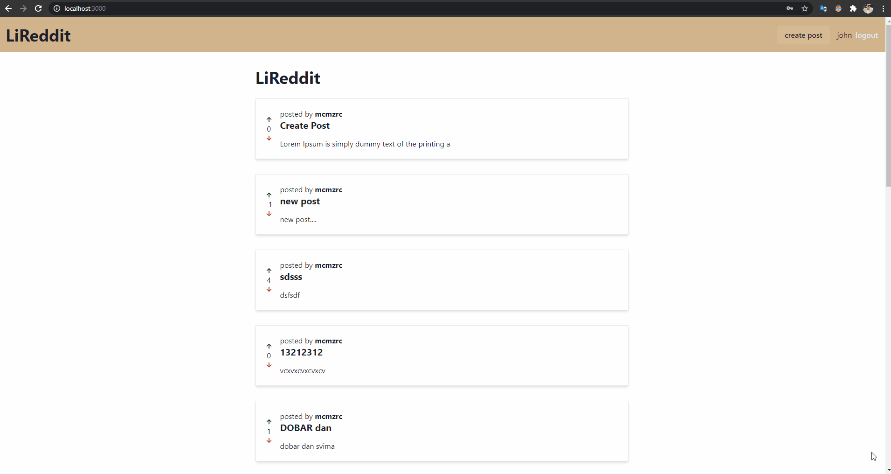

# NextJS GraphQL Express PostgresSQL

<h3>Building Reddit clone application, but purpose of this project create boilerplate for future projects.</h3>

Includes the follow technologies:

- React
- TypeScript
- GraphQL
- URQL/Apollo
- Node.js
- PostgreSQL
- MikroORM/TypeORM
- Redis
- Next.js
- TypeGraphQL
- Chakra

create post:

lazy loading:

